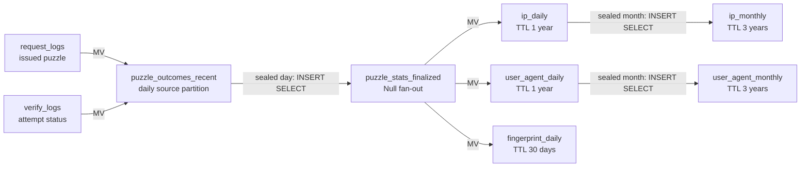
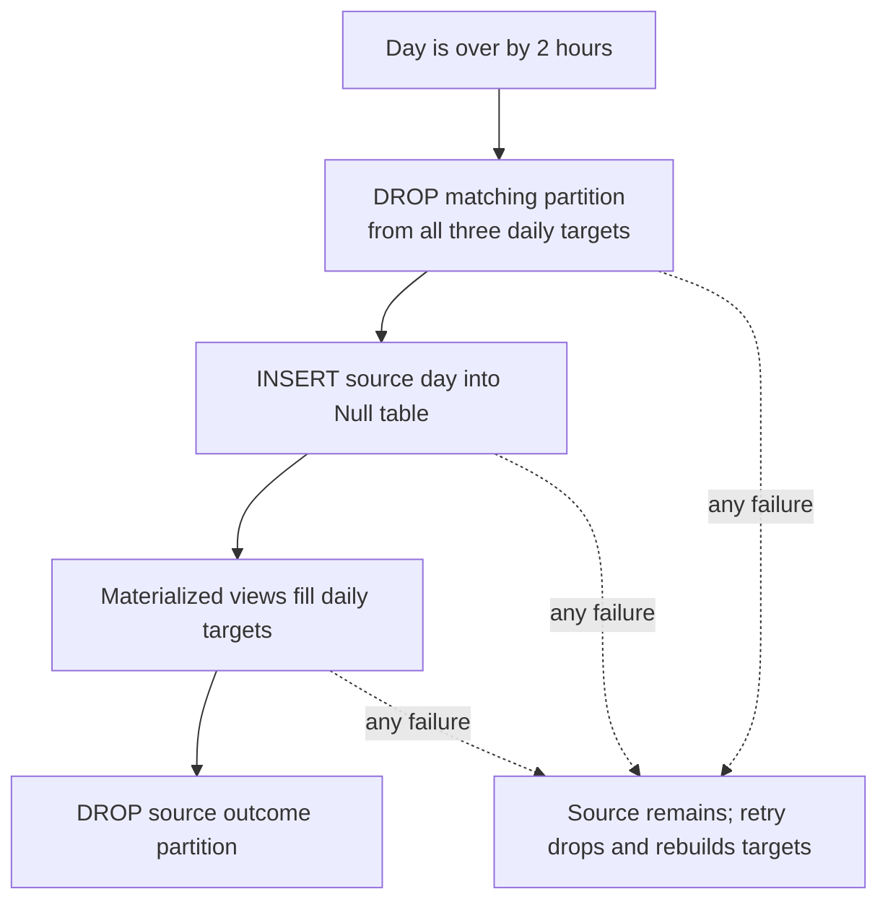

# ClickHouse Puzzle Statistics

Puzzle statistics are partitioned by the puzzle's UTC expiration date, not by arrival time. So we don't match `request_logs_1d` and `verify_logs_1d` exactly, but this allows to know when the cohort is closed and to do retry-safe replacement of one complete source partition.

## Current Flow

`puzzle_outcomes_recent` joins issued and verify events by `(expires_on, property_id, puzzle_id)`. Daily rows retain property and detailed IP/UA dimensions. Monthly rows retain only attempted puzzles, collapse `property_id` and UA major version, and store success plus failed-only counts. See [migrations 000016](../pkg/db/migrations/clickhouse/000016_create_puzzle_outcomes.up.sql) and [000017](../pkg/db/migrations/clickhouse/000017_create_puzzle_stats_daily.up.sql).

## Finalization

Partition is finalized by our maintenance job `PuzzleStatsFinalizationJob`. Each run uses a two-hour ingestion grace period, drains up to three oldest daily partitions, then processes at most one month only when no eligible daily partition remains. Finalizer eligibility also uses ClickHouse's UTC clock, so its cutoff cannot force an open cohort closed. See [`PuzzleStatsFinalizationJob`](../pkg/maintenance/puzzle_stats.go) and its [registration](../cmd/server/main.go#L446).

### Daily Replacement

The source partition is dropped **only after** the fan-out insert succeeds with `materialized_views_ignore_errors = 0`. Failures before that drop leave the source available; retry first drops every target partition and rebuilds it. If the source drop commits but its response is lost, the targets are already complete and the next scan finds no source. Verify-only records without an issued event are discarded with the source partition. See [`FinalizeNextPuzzleStats` and `PublishPuzzleStats`](../pkg/db/timeseries.go#L2670).

### Monthly Replacement

A month is eligible after `month end + 2h`, after the daily queue is drained, and only when no source outcome partition remains in that month. Publication drops the UA retry-marker partition first, then IP, and rebuilds IP followed by UA directly from daily tables. Daily source partitions are not dropped; their TTL removes them after one year. See [`FinalizeNextPuzzleStatsMonth`](../pkg/db/timeseries.go#L2699).

There is no staging table or completion marker. UA is written last and its attempted total is the retry marker; do not reorder IP and UA writes:

- `published < expected`: a missing/partial monthly write is dropped and rebuilt.
- `published == expected`: suppress duplicate work after a completed write or lost response.
- `published > expected`: the source shrank (normally daily TTL) or the target is over-counted; preserve and investigate. Do not change this comparison to `!=`.
- `expected == 0`: a never-published month produces no rows; existing monthly rows are preserved.

The total is a recovery heuristic, not proof that every dimension is complete.

## Late Arrivals

- Outcome materialized views accept expirations between `UTC date(now - 1h)` and `now + 2 days`. Daily finalization waits two hours, so events arriving after closure cannot recreate a dropped source partition; far-future timestamps cannot create unbounded partitions.
- Events accepted before closure remain in the source and are included when the whole day is rebuilt.
- A pending outcome partition blocks its month. Daily backlog is always drained before monthly publication.
- `puzzle_outcomes_recent` keeps source partitions for three days after expiration, leaving time for normal finalization retries without retaining a stalled backlog indefinitely. Monthly recovery is bounded by the daily tables' one-year TTL; a backlog longer than that can lose unpublished history.

## Deletion Invariants

- `DROP PARTITION` removes the entire date/month. Monthly dates are normalized to the first UTC day of the month. Never use partition drop for tenant-level deletion.
- Replacement is not transactional across tables. Readers may briefly observe missing or partially rebuilt targets between drops and inserts; retries provide convergence, not snapshot atomicity.
- Never drop an outcome source partition manually before all daily targets are populated. It is the only recovery source.
- Organization/user purges delete matching outcomes before row-deleting IP/UA daily and monthly targets because date partitions mix tenants. Property purges delete matching outcomes and IP/UA daily rows, but monthly rows omit `property_id` and cannot be deleted selectively. Fingerprint rows cannot be selectively purged because they contain no tenant dimensions and their unique-property aggregate state is not invertible. See [`lightDelete`](../pkg/db/timeseries.go#L1551).
