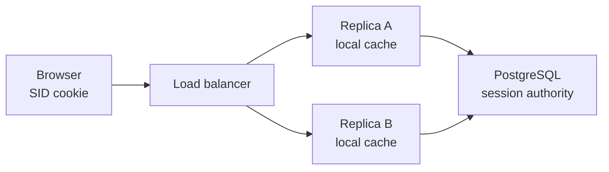
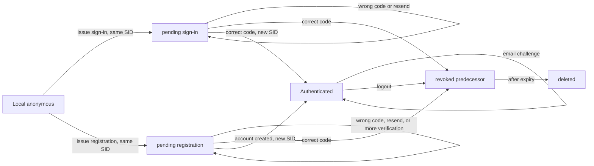
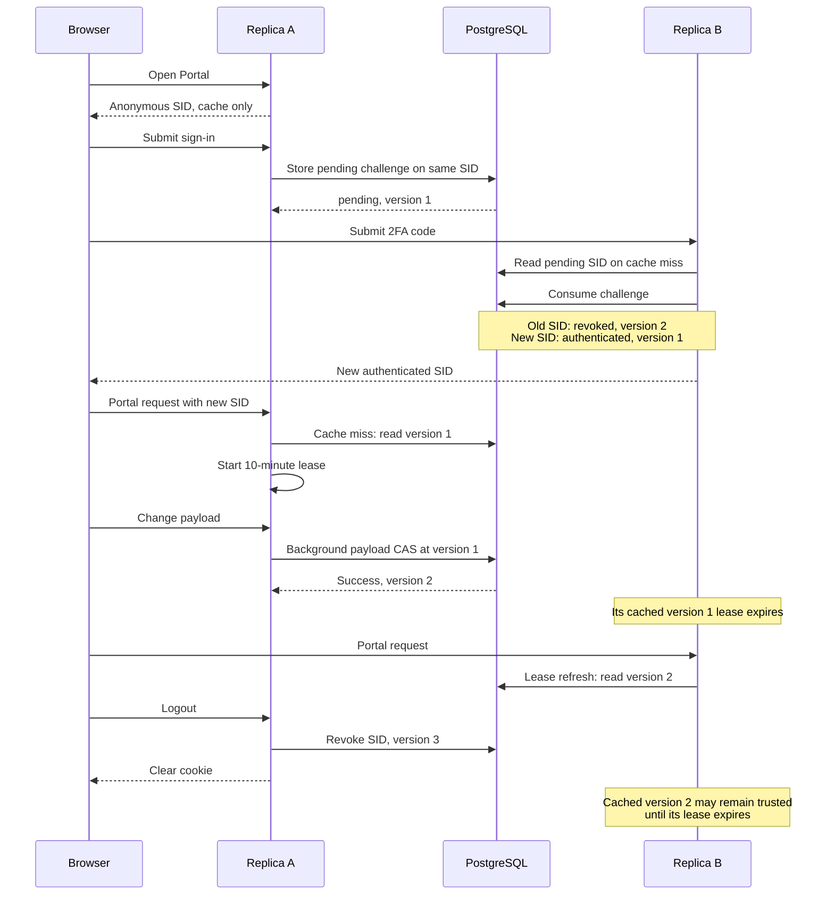

# Sessions

Sessions must be fast for normal Portal requests and safe when one session ID (SID) reaches different server replicas. Each replica has a local cache, while PostgreSQL is shared authority for authentication, challenges, expiration, and revocation.

## Architecture

The design has three layers:

- The browser cookie contains only a random SID.
- Each replica caches sessions, so most authenticated requests do not query PostgreSQL.
- `backend.sessions` stores state, version, user ID, expiration, challenge data, failed attempts, and a serialized payload. See [the schema](../pkg/db/migrations/postgres/000138_create_sessions.up.sql).

Authority and payload are separate in memory. Authority decides whether a session can authenticate or requires additional registration verification. Payload holds best-effort UI continuation data such as a name, return URL, invite ID, and notifications. Payload cannot change identity, challenge state, expiration, or revocation. See [`Authority` and `Payload`](../pkg/session/model.go).

The only stored states are `pending`, `authenticated`, and terminal `revoked`. Anonymous sessions exist only in one replica's cache. Pending challenge mutations always use guarded PostgreSQL queries, even when the session is cached. See [`sessions.sql`](../pkg/db/queries/postgres/sessions.sql).

Authenticated sessions have a fixed 10-minute validation lease. Inside the lease, requests trust the local cache. After it expires, the replica reads PostgreSQL and rejects missing, expired, revoked, disabled-user, or deleted-user authority. Database errors and stale reads fail closed. Same-version reads keep the local payload; newer versions replace it. See [`SessionStore.Resolve`](../pkg/db/session_cache.go).

## Typical Two-Replica Lifecycle

Replicas never synchronize directly. They meet through PostgreSQL.

### Sign-In and Activity

Version is written only by PostgreSQL:

| Operation | Version |
| --- | --- |
| Insert a session | Starts at `1` |
| Wrong code, resend, reissue, email challenge issue, or consumption | `+1` |
| Stale, expired, exhausted, or verification-required result | Unchanged |
| Successful sign-in | Old SID `+1`; successor starts at `1` |
| Successful registration | Old SID `+1`; later successor starts at `1` |
| Registration screening mark | Unchanged |
| Payload persistence | `+1` |
| First revocation | `+1` |
| Read, lease refresh, expiration renewal, or repeated revocation | Unchanged |

### Expiration Renewal

Authenticated requests schedule renewal when at most 2 hours 30 minutes remain. The request refreshes the three-hour cookie and queues the SID without waiting for PostgreSQL. A per-replica worker batches SIDs and extends only live authenticated rows with `GREATEST`; version does not change.

Queueing is best effort. A cookie may outlive the database row if renewal is dropped or fails, but the cookie cannot extend database authority. See [`ScheduleExpirationRenewal`](../pkg/session/manager.go) and `RenewSessionExpirations` in [`sessions.sql`](../pkg/db/queries/postgres/sessions.sql).

## Why Replicas Need Shared Authority

### Challenge Replay

Cached challenge data cannot authenticate a user. Every attempt is decided by a guarded PostgreSQL query, so replicas share expiration and the cumulative attempt count for that pending SID.

`ConsumeSignInChallenge` revokes the pending predecessor and inserts one authenticated successor in a single statement. Concurrent replicas therefore get one winner. With valid CSRF, registration consumes and revokes its challenge, then separately creates the account and authenticated successor. Registration screening runs in a background job after challenge issuance and marks both PostgreSQL and the local cached Authority when more verification is required. Resend preserves the existing attempt count. See [`ConsumeSignInChallenge`](../pkg/db/queries/postgres/sessions.sql) and [`postTwoFactor`](../pkg/portal/twofactor.go).

### Remote Revocation

Logout is an authenticated, CSRF-protected POST. It writes terminal `revoked` state before clearing the cookie. The local cache keeps a revoked marker so delayed local work cannot restore that SID.

Another replica may still trust an older cached copy until its 10-minute lease expires. This bounded delay avoids a database read on every request. Account deletion separately revokes all user-bound sessions. See [`Manager.Revoke`](../pkg/session/manager.go) and `RevokeSession`/`RevokeUserSessions` in [`sessions.sql`](../pkg/db/queries/postgres/sessions.sql).

### Stale Resurrection

Payload changes are persisted by an update-only, expected-version query. It can update only live rows and cannot recreate a missing or revoked SID. A version conflict evicts the matching stale cache entry instead of overwriting newer authority.

Expiration renewal also updates only live authenticated rows. Revoked rows remain until expiration cleanup, so delayed workers cannot make them valid again. See [`UpdateSessionPayloads`](../pkg/db/queries/postgres/sessions.sql) and [`session_payload.go`](../pkg/db/session_payload.go).

## Important Limits

- Remote revocation is lease-bounded, not immediate, and does not cancel requests already running.
- Failed attempts are cumulative per pending SID, not per user. A new captcha-backed SID gets a new budget.
- Payload persistence and expiration renewal are best effort; concurrent payload edits are not merged.
- Registration consumption, account creation, and successor insertion are separate. Failure can consume a challenge or create an account without signing the browser in.
- Registration screening is best effort and asynchronous. Challenge completion can win the race with a screening result that has not been persisted yet, and a process or database failure can lose the result.
- Email challenge consumption and the user email update are separate. A failed update leaves the challenge consumed.
- Account deletion commits before separate session revocation. If revocation fails, cached sessions remain lease-bounded.
- Concurrent cache misses may duplicate reads. Revoked cache markers are bounded by the cache's 10,000-entry, 15-minute sliding residency.
- Lost successful responses are not recovered. Legacy sessions and mixed old/new server replicas are unsupported.
