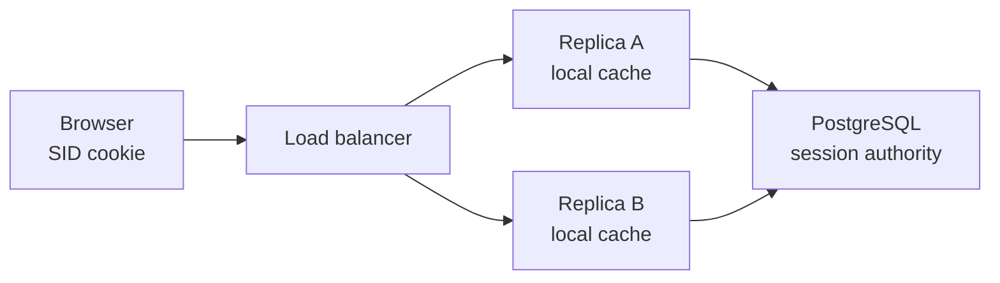
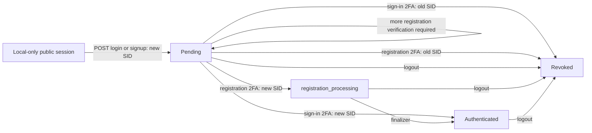
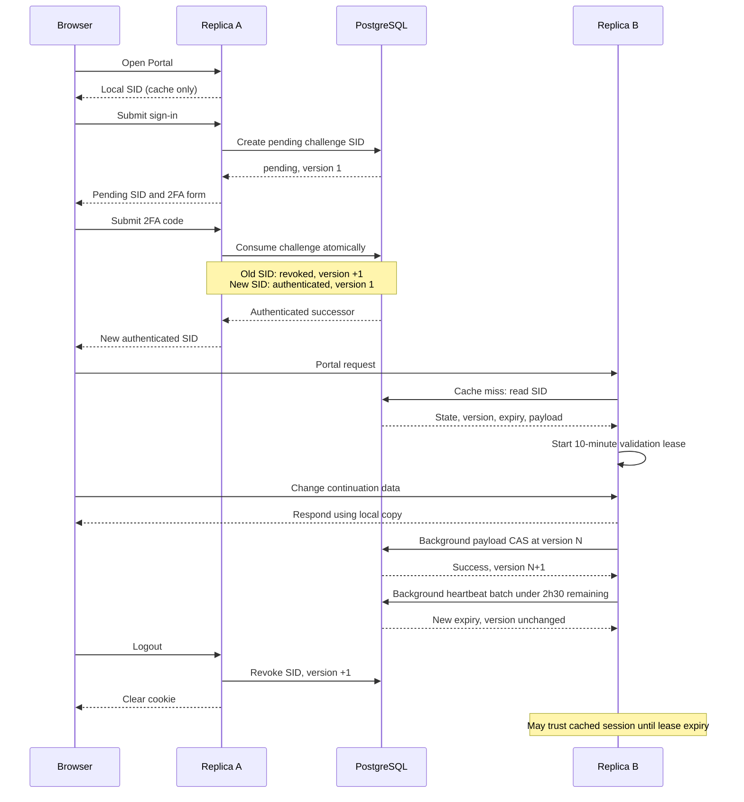

# Sessions

Sessions must be fast for normal Portal requests and safe when requests for one session ID (SID) reach different server replicas. A local cache provides speed, but it cannot coordinate replicas. PostgreSQL is therefore the shared authority for every security-sensitive session transition.

## Architecture

The design has three layers:

- The browser cookie contains only a random SID.
- Each replica keeps a local session copy so most authenticated requests need no session query.
- The logged `backend.sessions` table stores shared authority: state, version, user ID, expiration, challenge, and failed attempts. See [the session schema](../pkg/db/migrations/postgres/000138_create_sessions.up.sql).

The serialized payload stores continuation data such as the login step, return URL, and notifications. It cannot change the authoritative columns: `state` and `expires_at` decide whether the SID is usable, `version` rejects stale writes, `user_id` binds it to an account, and the challenge columns keep code validation and attempts shared across replicas.

Public sessions used before a sign-in or registration challenge are local-only and do not write PostgreSQL. Challenge sessions are different because every replica must share the same code, expiration, and attempt count, and only one authentication transition may win. Their `pending` row must exist before its SID cookie is returned. A successful 2FA transaction revokes the old pending SID and creates the new SID shown by the paired arrows above.

Authenticated sessions use a fixed 10-minute local validation lease. Requests inside the lease use memory. After the lease, the replica reads PostgreSQL and refreshes its local authority. It replaces the complete local copy unless the database is still at the same version and the copy has an unpersisted continuation-data change. A revoked, missing, or expired session is rejected. A database failure returns `503` instead of treating the session as valid.

Cookie and database expiration use a sliding three-hour deadline maintained by background heartbeats. The request path is implemented by [`Server.private`](../pkg/portal/server.go), [`SessionStore.Read`](../pkg/db/session.go), and [`SessionData`](../pkg/session/common.go).

## Typical Two-Replica Lifecycle

Replicas never sync directly. PostgreSQL is the authority used for replica handoff, validation, and writes.

### Sign-In and Activity

Replica B loads the complete session on its first request. Later requests use memory until the validation lease or cached expiration requires a PostgreSQL read. That read replaces the complete cache entry unless it is preserving an unpersisted same-version continuation-data change. Reads and validation do not change the version.

Typical version changes:

| Operation | Version |
| --- | --- |
| Create a row | Starts at `1` |
| Successful sign-in | Old pending SID `+1`; authenticated successor starts at `1` |
| Successful payload batch | `+1` |
| Read, validation lease, or heartbeat | Unchanged |
| First revocation | `+1` |

### Expiration Heartbeats

Authenticated requests claim a heartbeat when less than two hours and 30 minutes remain:

- The claim sets `expirationRenewalPending`, so concurrent requests do not enqueue duplicates.
- A successful enqueue refreshes the cookie; an enqueue failure clears the claim for retry.
- Heartbeats are batched and PostgreSQL extends only unexpired `authenticated` rows to three hours from the current time.
- A database error keeps the batch for retry. A confirmed update extends the cached deadline and clears the claim.
- If PostgreSQL does not update a SID, its cached copy is stale and evicted.
- Heartbeat claims are replica-local, so two replicas may renew the same SID safely. Heartbeats do not change the version.

Queueing alone never extends local trust. See [`ClaimExpirationRenewal`](../pkg/session/common.go), [`heartbeatSessions`](../pkg/db/session.go), and `ExtendAuthenticatedSessionExpirations` in [`sessions.sql`](../pkg/db/queries/postgres/sessions.sql).

## Why Replicas Need Shared Authority

### Challenge Replay

If challenge validation and deletion are separate operations, two replicas can both validate the same code before either removes it. Both requests could then create authenticated sessions from one challenge.

`ConsumeSignInChallenge` solves this with one PostgreSQL statement. It locks the pending session and user, checks the purpose, code, expiration, attempt limit, user, and email, then does one of two things:

- A wrong code increments the shared attempt count.
- A correct code revokes the old SID and inserts one authenticated successor.

The state change and successor insert commit together. PostgreSQL can therefore commit at most one successor for that pending SID. A stale replica must still run this statement; cached challenge data can never authenticate a user by itself.

Resend also updates the shared code and attempt count in PostgreSQL. Email change uses the same pattern: challenge consumption and the user email update happen in one locked statement. See [`postTwoFactor`](../pkg/portal/twofactor.go) and the guarded queries in [`sessions.sql`](../pkg/db/queries/postgres/sessions.sql).

Registration needs one extra state because account creation happens after code validation. Consuming the challenge atomically revokes the old SID and creates a `registration_processing` successor. Only that winner runs account creation. After success, it authenticates the successor locally and a guarded background job changes PostgreSQL to `authenticated`. Other replicas reject the processing session until that final update succeeds. See [`doRegister`](../pkg/portal/register.go) and [`registrationFinalizerJob`](../pkg/portal/jobs.go).

### Remote Revocation

Deleting a session from one replica does not remove the same SID from another replica's memory. Without revalidation, a cached authenticated session could remain usable after logout.

Logout now changes the PostgreSQL row to terminal `revoked` before clearing the local session and cookie. Other replicas may still accept their cached copy only until its fixed lease expires. Local reads do not extend the lease. The next authoritative read sees `revoked`, removes the local copy, and rejects the SID.

Remote logout is therefore bounded by 10 minutes, not immediate. This is the deliberate tradeoff that avoids a PostgreSQL read on every request and avoids a separate cluster invalidation system. Logout revokes only the presented SID, not every session for that user. See [`SessionDestroy`](../pkg/session/manager.go), [`RevokeUserSession`](../pkg/db/business_impl.go), and `RevokeSession` in [`sessions.sql`](../pkg/db/queries/postgres/sessions.sql).

### Stale Resurrection

Session payload changes are persisted in background batches. With an unconditional insert-or-update, a delayed write from a stale replica could recreate a SID after another replica revoked or deleted it. A stale full-session write could also overwrite newer security state.

Background persistence now uses an update-only, version-checked query:

- It cannot insert a missing SID.
- It can update only a live `pending` or `authenticated` row.
- It changes only the payload and version, never state, user ID, challenge, attempts, or expiration.
- A version mismatch evicts the stale local copy instead of overwriting the newer row.

Expiration heartbeats update only live authenticated rows. Keeping revoked rows in a terminal state means an old payload or heartbeat cannot make them valid again. See `UpdateSessionDataCAS` in [`sessions.sql`](../pkg/db/queries/postgres/sessions.sql) and [`StoreUserSessions`](../pkg/db/business_impl.go).

## Important Limits

- The 10-minute lease bounds when another replica admits a new request. It does not cancel requests already running when logout occurs.
- Single-use challenge protection is per pending SID. Starting another login creates another independent challenge.
- Concurrent non-security payload changes are not merged. One replica's continuation-data update may be lost after a version conflict.
- Registration finalization is an in-memory job with limited retries. If it is lost, the account may exist while the processing session remains unusable, and the user may need to sign in again.

Legacy cache sessions are intentionally incompatible with this design. Deployment must drain old replicas before starting new ones, and existing users must sign in again. Mixed-version deployment is unsupported.
